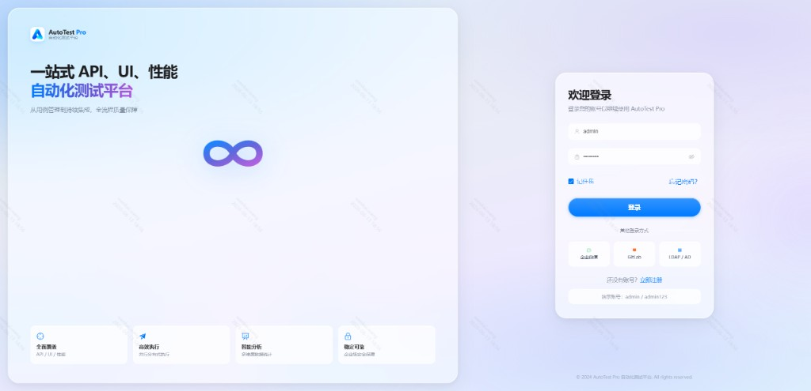

<div align="center">


# AutoTest Pro · 一站式自动化测试平台


**覆盖 API、UI、性能测试的企业级自动化测试解决方案**


集用例管理、可视化编排、断言校验、执行看板于一体的前后端分离平台


<!-- Tech badges -->


</div>


<div align="center">

  

</div>


---


## 📖 项目简介


**AutoTest Pro** 是一个前后端分离架构的一站式自动化测试平台，参考企业级测试平台的产品设计与交互体验，使用 **Python (FastAPI)** 构建后端服务、**Vue 3** 构建前端界面。


平台面向接口测试、UI 自动化测试与性能测试场景，提供从 **用例管理 → 测试编排 → 执行校验 → 数据看板** 的完整闭环，可作为自动化测试平台的脚手架或教学示例。


界面采用 **Liquid Glass（液态玻璃）** 视觉风格：毛玻璃面板、柔和渐变光晕与流畅交互动效，整体观感现代、轻量。


### ✨ 核心亮点


- 🧩 **多测试类型** — 同时支持 API、UI、性能三类测试用例的管理与执行

- 🌳 **目录化管理** — 接口/用例按模块树形组织，支持模块与用例的增删改查

- 🛠️ **可视化请求构造** — Params / Headers 表格编辑器、JSON 高亮代码编辑器、多种 Body 类型

- ✅ **断言引擎** — 状态码、响应时间、JSON 字段等多维度断言校验

- 📊 **数据看板** — 基于 ECharts 的执行趋势、通过率、失败分布等可视化图表

- 🔐 **JWT 鉴权** — 完整的登录态管理、路由守卫与请求拦截

- 👤 **个人中心** — 头像上传、账号/安全/通知设置、操作日志与**实时登录记录**

- 📚 **内置帮助** — 顶栏帮助按钮可弹窗阅读本 README 文档

- 📚 **自动文档** — FastAPI 自动生成 Swagger / OpenAPI 接口文档


---


## 🏗️ 技术架构


```

┌─────────────────────────┐         HTTP / JSON          ┌──────────────────────────┐

│      前端 (Vue 3)        │   ───────────────────────▶   │      后端 (FastAPI)        │

│  Vite · Element Plus     │    /api/v1  (Vite Proxy)     │   Uvicorn · SQLAlchemy     │

│  Pinia · Vue Router      │   ◀───────────────────────   │   JWT 鉴权 · Pydantic      │

│  Axios · ECharts         │         Bearer Token         │   SQLite · 静态文件        │

└─────────────────────────┘                              └──────────────────────────┘

```


### 后端技术栈（Python）


| 技术 | 版本 | 说明 |

| --- | --- | --- |

| [Python](https://www.python.org/) | 3.11+ | 运行环境 |

| [FastAPI](https://fastapi.tiangolo.com/) | 0.115 | 高性能异步 Web 框架，自动生成 OpenAPI 文档 |

| [Uvicorn](https://www.uvicorn.org/) | 0.32 | ASGI 服务器 |

| [SQLAlchemy](https://www.sqlalchemy.org/) | 2.0 | ORM，数据库模型与查询 |

| [SQLite](https://www.sqlite.org/) | 内置 | 轻量级数据库（零配置，开箱即用） |

| [Pydantic](https://docs.pydantic.dev/) | 2.10 | 数据校验与序列化（Schema） |

| [python-jose](https://github.com/mpdavis/python-jose) | 3.3 | JWT 令牌签发与校验 |

| [passlib + bcrypt](https://passlib.readthedocs.io/) | 1.7 / 4.0 | 密码哈希加密 |

| [httpx](https://www.python-httpx.org/) | 0.28 | 异步 HTTP 客户端，用于 API 用例执行 |


> **后端特性：** RESTful API · JWT 鉴权 · CORS 跨域 · 登录记录持久化 · 头像静态资源托管 · 自动 Swagger 文档 · 启动自动建表与种子数据。


### 前端技术栈（Vue）


| 技术 | 版本 | 说明 |

| --- | --- | --- |

| [Vue 3](https://vuejs.org/) | 3.5 | 渐进式前端框架（Composition API + `<script setup>`） |

| [Vite](https://vitejs.dev/) | 6.0 | 前端构建工具与开发服务器 |

| [Element Plus](https://element-plus.org/) | 2.9 | 企业级 UI 组件库 |

| [@element-plus/icons-vue](https://element-plus.org/) | 2.3 | 图标库 |

| [Vue Router](https://router.vuejs.org/) | 4.5 | 路由与登录守卫 |

| [Pinia](https://pinia.vuejs.org/) | 2.3 | 状态管理（用户 / Token / Session） |

| [ECharts](https://echarts.apache.org/) | 5.5 | 数据可视化图表 |

| [Axios](https://axios-http.com/) | 1.7 | HTTP 请求与拦截器 |

| [marked](https://marked.js.org/) | 18.0 | Markdown 渲染（帮助文档弹窗） |

| [Sass](https://sass-lang.com/) | 1.83 | CSS 预处理器 |


> **前端特性：** 前后端分离 · Liquid Glass UI · JWT 自动注入 · 路由鉴权 · 侧边栏折叠动画 · 响应式布局 · ECharts 看板 · Vite 代理转发。


---


## 🧭 功能模块


| 模块 | 说明 |

| --- | --- |

| **登录页** | 双栏 Hero 布局、品牌 Logo、账号密码登录；登录成功后写入会话记录 |

| **主框架** | 可折叠侧边栏、顶栏项目/环境切换、用户菜单、帮助文档入口 |

| **工作台 Dashboard** | 用例数 / 成功率等统计卡片、7 天执行趋势、模块通过率、失败原因环形图、性能响应趋势、最近执行记录、快捷入口 |

| **项目管理** | 项目概览、模块增删改查、成员管理、关联环境、最近测试报告、项目信息 |

| **API 测试** | 接口目录树、请求构造（Method / URL / Params / Headers / Body）、断言列表、响应结果展示、用例与模块增删改查 |

| **UI 测试** | 用例树、测试步骤可视化编排、步骤导入导出、执行结果日志、元素库与页面预览 |

| **测试计划** | 测试计划的创建、列表、运行与删除 |

| **个人中心** | 头像上传（JPG/PNG/WebP/GIF，≤ 2MB）、基本信息、安全设置、通知偏好、操作日志；右侧**最近登录记录**每 15 秒自动刷新，标记当前设备为「本机」 |

| **其余菜单** | 性能测试、执行记录、测试报告、环境配置、数据管理、系统管理（占位页） |


---


## 📂 目录结构


```

ikunAICoding/

├── backend/                  # Python FastAPI 后端

│   ├── app/

│   │   ├── api/              # 路由：auth / dashboard / projects / cases / plans

│   │   ├── core/             # 配置 / 数据库 / 安全 (JWT, 加密)

│   │   ├── models/           # SQLAlchemy 数据模型（含 login_records）

│   │   ├── schemas/          # Pydantic 模型

│   │   ├── utils/            # 客户端 IP / User-Agent 解析等工具

│   │   ├── seed.py           # 初始化种子数据

│   │   └── main.py           # 应用入口（静态文件挂载）

│   ├── uploads/              # 用户上传资源（头像等，已 gitignore）

│   └── requirements.txt

├── frontend/                 # Vue 3 前端

│   ├── public/

│   │   └── logo.png          # 品牌 Logo

│   ├── src/

│   │   ├── api/              # Axios 封装与接口

│   │   ├── components/       # 公共组件（KvEditor / CodeEditor / HelpDocDialog 等）

│   │   ├── layouts/          # 主框架布局（侧边栏 + 顶栏）

│   │   ├── router/           # 路由与守卫

│   │   ├── store/            # Pinia 状态

│   │   ├── styles/           # 全局样式、Liquid Glass 主题与交互

│   │   └── views/            # 页面（登录 / 看板 / 项目 / API / UI / 计划 / 个人中心）

│   ├── vite.config.js

│   └── package.json

└── README.md

```


---


## 🚀 快速开始


### 环境要求


- Python **3.11+**

- Node.js **18+** 与 npm


### 1️⃣ 启动后端


```bash

cd backend

python -m venv .venv


# Windows

.venv\Scripts\activate

# macOS / Linux

# source .venv/bin/activate


pip install -r requirements.txt

uvicorn app.main:app --reload --port 8010

```


- 后端地址：<http://127.0.0.1:8010>

- API 文档（Swagger）：<http://127.0.0.1:8010/docs>

- 首次启动会自动创建 SQLite 数据库并写入演示数据。

- 端口可自行调整；如修改后端端口，请同步修改 `frontend/vite.config.js` 中的代理 `target`。


### 2️⃣ 启动前端


```bash

cd frontend

npm install

npm run dev

```


- 前端地址：<http://localhost:5173>（端口被占用时 Vite 会自动顺延）

- Vite 已配置代理，`/api/v1` 请求自动转发到后端 `127.0.0.1:8010`。


### 3️⃣ 登录系统


| 用户名 | 密码 |

| --- | --- |

| `admin` | `admin123` |


> 登录成功后返回 `token` 与 `session_id`；`session_id` 用于个人中心标记「本机」登录记录。若升级后看不到登录记录，重新登录一次即可。


---


## 🔌 主要接口


| 方法 | 路径 | 说明 |

| --- | --- | --- |

| `POST` | `/api/v1/auth/login` | 用户登录，返回 JWT 与 `session_id` |

| `GET` | `/api/v1/auth/me` | 当前登录用户 |

| `GET` | `/api/v1/auth/login-records` | 最近登录记录（支持 `limit` / `offset` / `session_id`） |

| `POST` | `/api/v1/auth/avatar` | 上传用户头像（multipart/form-data） |

| `GET` | `/api/v1/static/avatars/{filename}` | 头像静态资源 |

| `GET` | `/api/v1/dashboard` | 工作台概览数据 |

| `GET` | `/api/v1/projects` | 项目列表 |

| `GET` | `/api/v1/projects/{id}` | 项目详情（含模块） |

| `GET` | `/api/v1/api-cases` | API 用例列表 |

| `POST` | `/api/v1/api-cases/run` | 执行 API 请求并校验断言 |

| `GET` | `/api/v1/ui-cases` | UI 用例列表 |

| `POST` | `/api/v1/ui-cases/{id}/run` | 执行 UI 用例 |

| `GET` | `/api/v1/test-plans` | 测试计划列表 |

| `POST` | `/api/v1/test-plans` | 新建测试计划 |

| `DELETE` | `/api/v1/test-plans/{id}` | 删除测试计划 |


> 除登录外，所有接口均需在请求头携带 `Authorization: Bearer <token>`。完整接口列表见 Swagger 文档。


---


## 📄 License


本项目以 [MIT License](https://opensource.org/licenses/MIT) 开源，仅供学习与参考使用。

